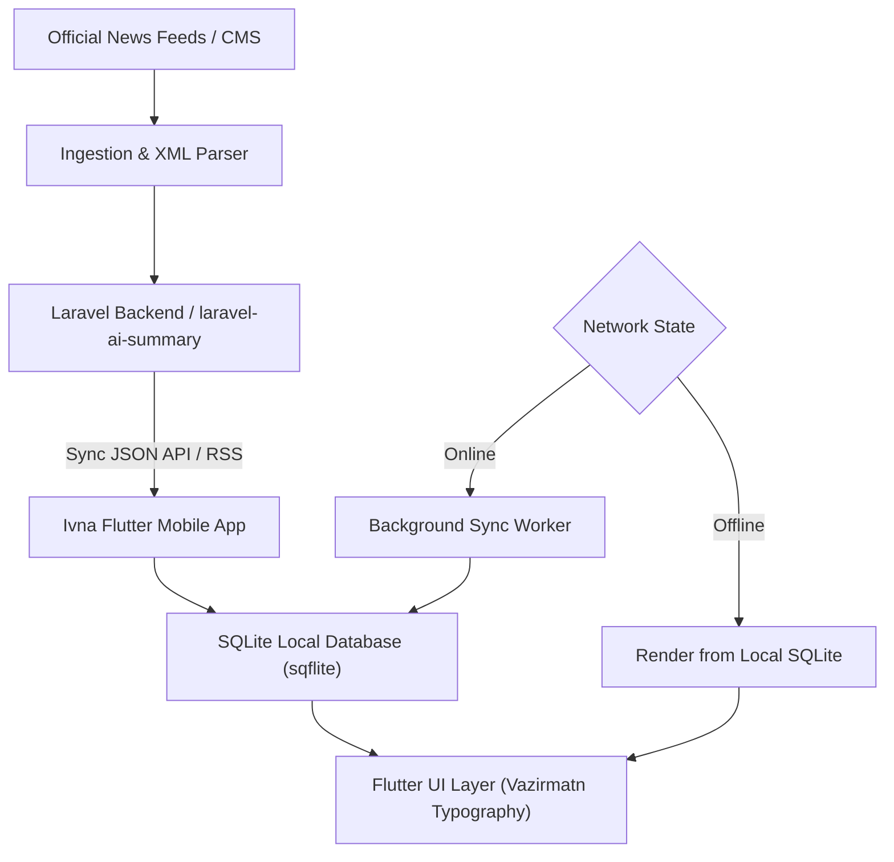

# Ivna News (ایونا نیوز) — Mobile Application & Intelligent Media Architecture

**Cross-platform, offline-first news reader and media publishing client powered by automated RSS ingestion, AI summarization pipelines, and clean Persian typography.**

*Part of the [Molavi AI Engineering Ecosystem](https://github.com/tmolavi/geo-scope/blob/main/docs/GITHUB_ECOSYSTEM.md) — by [Taghi Molavi](https://molavi.pro)*

---

## 1. What It Is

**Ivna News (ایونا نیوز)** is a production cross-platform mobile application engineered as an offline-first, high-throughput news reader and media client. It connects users to official news channels through automated multi-domain RSS ingest pipelines, local SQLite caching, and integrated AI summarization layers.

---

## 2. The Problem

Modern digital media consumers face network instability, content clutter, and fragmented publishing streams:
- **Network Degradation**: Intermittent mobile connectivity interrupts content access.
- **Feed Inconsistency**: RSS feeds often suffer from domain outages, malformed XML, and unstandardized media enclosures.
- **Reading Fatigue**: Long-form press releases require concise, structured bullet summaries for rapid decision-making.

Ivna News addresses these challenges through client-side offline storage, multi-domain failover routing, and automated AI summary integration via [`laravel-ai-summary`](https://github.com/tmolavi/laravel-ai-summary).

---

## 3. Key Features

* **Offline-First Storage**: Local SQLite caching (`sqflite`) preserves full article content and metadata for offline browsing.
* **Smart Feed Ingestion & Failover**: Multi-domain sync engine parses, normalizes, and deduplicates RSS streams across primary and fallback endpoints.
* **AI Summary Integration**: Interfaces with backend summarization pipelines to present executive bullet points.
* **Background Synchronization**: Headless sync workers (`workmanager`) keep local feeds fresh.
* **Tailored Persian Typography**: Polished UI built around the `Vazirmatn` typeface with adaptive dark mode.

---

## 4. Architecture & Data Flow

---

## 5. Technology Stack

* **Framework**: Google Flutter SDK (Dart 3)
* **Local Persistence**: `sqflite`, `shared_preferences`
* **Networking & Parsing**: `http`, `xml`, `connectivity_plus`
* **Background Tasks**: `workmanager`
* **Notifications**: `flutter_local_notifications`

---

## 6. Download & Installation

### 🇮🇷 Cafe Bazaar (Android):
👉 **[Download Ivna News on Cafe Bazaar](https://cafebazaar.ir/app/com.ivnanews.ivna_news_app)**

---

## 7. Related Projects

Part of the **Molavi AI Engineering Ecosystem**:

* [**laravel-ai-summary**](https://github.com/tmolavi/laravel-ai-summary): Backend AI summarization engine powering rapid content ingestion.
* [**geo-aeo-news-engine**](https://github.com/tmolavi/geo-aeo-news-engine): Autonomous news rewriting and digital PR GEO optimization engine.
* [**GEO-Scope**](https://github.com/tmolavi/geo-scope): Multi-model AI visibility benchmark engine.
* [**Ecosystem Map**](https://github.com/tmolavi/geo-scope/blob/main/docs/GITHUB_ECOSYSTEM.md): Complete architecture and evidence flow.

---

## 8. Author & Official Credits

* **Architecture & Development**: [Taghi Molavi](https://molavi.pro)
* **Publisher & License Holder**: Negahe Iranian News Agency (پایگاه خبری نگاه ایرانیان نیوز - ایونا) — Dr. Mehdi Karimi Tafarshi
